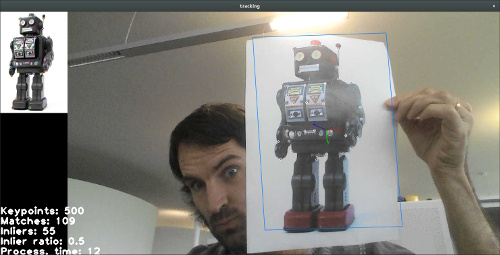

chilitrack
==========

A marker-less tracking solution for augmented reality.



Currently, a demo app that tracks a given template in the camera
feed, and show the corresponding 3D transformation.

It relies on ORB (or AKAZE) features to find the template in the target image (closely following
[this
approach](http://docs.opencv.org/trunk/doc/tutorials/features2d/akaze_tracking/akaze_tracking.html)), then track the object using the [video optical flow](http://docs.opencv.org/trunk/modules/video/doc/motion_analysis_and_object_tracking.html#calcopticalflowpyrlk) and finally estimate a [3D transformation](http://docs.opencv.org/trunk/modules/calib3d/doc/camera_calibration_and_3d_reconstruction.html#solvepnp).

Prerequisites
-------------

`chilitrack` depends on `OpenCV 3`. You likely need to install `OpenCV 3` by
hand since it is not yet packaged.


Installation
------------

```
> mkdir build
> cmake ..
> make
```

Usage
-----

```
> tracker <template image to track>
```

